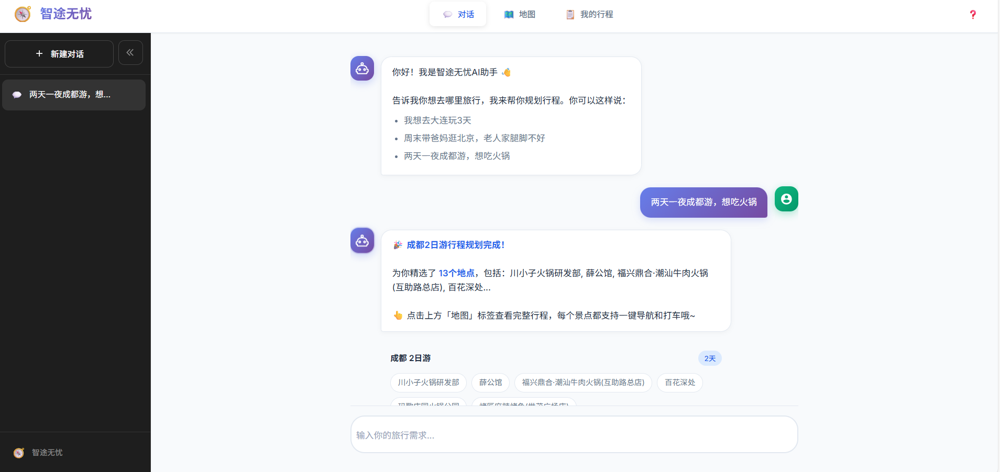
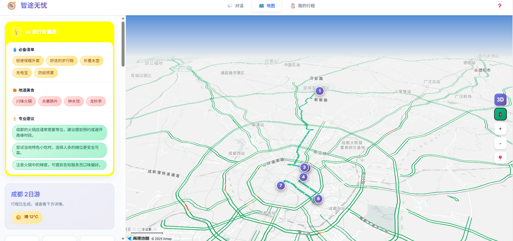
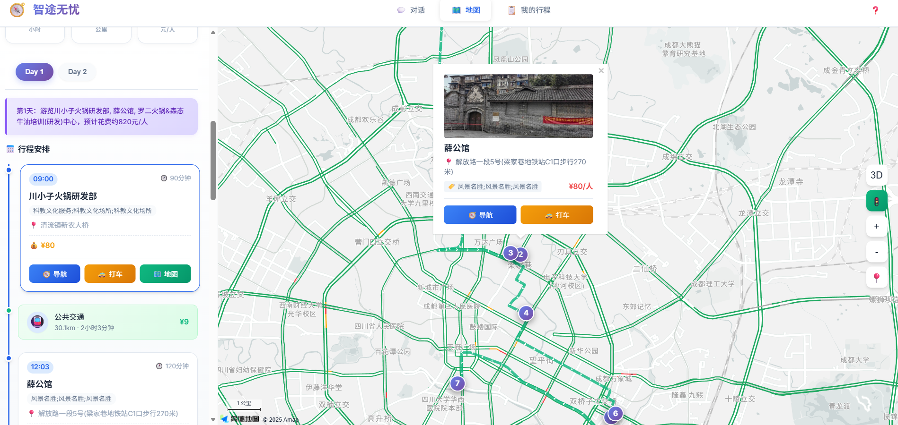

# 智途无忧 - AI智能旅行规划助手

<p align="center">
  
  
  
  
</p>

<p align="center">
  <b>🗺️ 一句话，生成完整旅行计划</b><br>
  基于高德开放平台 + 通义千问大模型的智能旅行规划系统
</p>

---

## 🌟 核心亮点

| 💬 自然语言交互 | 🗺️ 沉浸式地图 | 📅 可视化时间轴 | 🎒 AI旅行智囊 |
|:---:|:---:|:---:|:---:|
| 一句话生成行程 | 3D视角+实时路况 | 每天安排明明白白 | 行李/美食/避坑 |
| 多轮对话引导 | 一键导航/打车 | 导航打车一键直达 | 天气智能联动 |

```
用户：想去杭州玩3天，带爸妈，老人家走不动太多路

小智：🎉 杭州3日游行程规划完成！为你精选了12个地点...
      考虑到有老人同行，已优先安排平坦好走的景点~
```

---

## 🚀 快速开始

### 1️⃣ 获取 API Key

| 平台 | 获取地址 | 用途 |
|:---|:---|:---|
| 高德开放平台 | [console.amap.com](https://console.amap.com/) | Web服务Key + JS API Key |
| 通义千问 | [dashscope.console.aliyun.com](https://dashscope.console.aliyun.com/) | AI对话 |
| Tavily | [tavily.com](https://tavily.com/) | 联网搜索（可选） |

### 2️⃣ 安装 & 配置

```bash
# 克隆项目
git clone <repository-url>
cd amap_dev/backend

# 创建虚拟环境
conda create -n amap_dev python=3.11 --y
conda activate amap_dev

# 安装依赖
pip install -r requirements.txt

# 配置环境变量
cp .env.example .env
# 编辑 .env 填入你的 API Key
```

```ini
# .env 文件内容
AMAP_API_KEY=your_amap_web_service_key
QWEN_API_KEY=your_dashscope_api_key
TAVILY_API_KEY=your_tavily_api_key  
```

### 3️⃣ 配置前端

编辑 `frontend/js/config.js`：

```javascript
const CONFIG = {
    AMAP_KEY: 'your_amap_js_api_key',
    // ...
};
```

### 4️⃣ 启动服务

```bash
uvicorn app.main:app --reload --port 8000
```

访问 **http://localhost:8000** 开始使用 🎉

---

## 🔶 高德开放平台集成

本项目深度集成高德开放平台 **12项核心能力**：

| 能力 | API | 应用场景 |
|:---|:---|:---|
| 🗺️ **地图展示** | JS API 2.0 | 网页地图渲染、3D视角、实时路况图层 |
| 🔍 **搜索服务** | POI搜索/周边搜索 | 景点、餐厅、酒店智能搜索 |
| 🛣️ **路径规划** | 步行/驾车/公交 | 计算景点间最优路线和时间 |
| 📍 **地理编码** | 正/逆地理编码 | 城市名↔经纬度坐标转换 |
| 🔗 **URI调起** | 导航/打车URI | 一键跳转高德App导航或打车 |
| 🌤️ **天气服务** | 天气查询API | 获取目的地实时天气和预报 |

<details>
<summary>📝 URI 调起示例代码</summary>

```javascript
// 一键导航 - 跳转高德地图App
const navUrl = `https://uri.amap.com/navigation?to=${lng},${lat},${name}&mode=car&callnative=1`;
window.open(navUrl);

// 一键打车 - 调起高德打车
const taxiUrl = `https://uri.amap.com/line?to=${lng},${lat},${name}&mode=taxi&callnative=1`;
window.open(taxiUrl);
```

</details>

---

## ✨ 功能详解

### 🤖 智能对话系统

- **自然语言理解** - 通义千问解析意图，提取城市、天数、偏好
- **多轮对话** - 上下文记忆，智能追问缺失信息
- **流式输出** - 打字机效果，实时显示AI回复
- **联网搜索** - Tavily API获取最新旅游资讯

### 🗺️ 地图交互系统

- **3D视角** - pitch=60° rotation=15° 沉浸式体验
- **实时路况** - Traffic图层显示道路拥堵情况
- **智能标记** - 渐变色圆形Marker，悬停动画效果
- **信息窗体** - 点击标记显示详情+导航+打车按钮

### 📅 行程管理系统

- **多日规划** - 自动分配景点到每一天
- **时间安排** - 计算游览时长+交通时间
- **费用统计** - 门票+餐饮+交通自动汇总
- **行程保存** - SQLite持久化存储

### 🎯 智能推荐系统

- **行李清单** - 根据天气+行程智能推荐
- **美食攻略** - POI搜索+LLM筛选当地特色
- **避坑指南** - LLM生成实用建议

---

## 🎨 界面预览

<details>
<summary>💬 对话规划流程</summary>



</details>

<details>
<summary>📅 时间轴行程卡片</summary>


</details>

---

## 🛠️ 技术架构

```
┌─────────────────────────────────────────────────────────────┐
│                        前端 (Frontend)                       │
│  ┌──────────┐ ┌──────────┐ ┌──────────┐ ┌──────────┐       │
│  │ chat.js  │ │  map.js  │ │ timeline │ │  app.js  │       │
│  │ 对话管理  │ │ 地图封装  │ │  时间轴   │ │ 核心逻辑  │       │
│  └──────────┘ └──────────┘ └──────────┘ └──────────┘       │
│                          ↓                                   │
│                   高德 JS API 2.0                            │
│          (地图渲染 / 3D视角 / 路况图层 / 路线绘制)             │
└─────────────────────────────┬───────────────────────────────┘
                              │ HTTP API
┌─────────────────────────────┴───────────────────────────────┐
│                        后端 (Backend)                        │
│  ┌────────────────────────────────────────────────────┐     │
│  │              FastAPI 异步路由层                      │     │
│  │      /api/chat    /api/trip    /api/weather        │     │
│  └────────────────────────────────────────────────────┘     │
│                          ↓                                   │
│     ┌────────┐  ┌────────┐  ┌────────┐  ┌────────┐         │
│     │ 通义千问 │  │高德Web │  │ Tavily │  │ SQLite │         │
│     │  LLM   │  │ 服务API │  │  搜索   │  │ 数据库  │         │
│     └────────┘  └────────┘  └────────┘  └────────┘         │
└─────────────────────────────────────────────────────────────┘
```

| 层级 | 技术 | 说明 |
|:---:|:---|:---|
| **前端** | 原生 JS + 高德 JS API 2.0 | 轻量无依赖，地图渲染/3D/路况 |
| **后端** | FastAPI + SQLAlchemy | 高性能异步框架 + 异步ORM |
| **AI** | 通义千问 + Tavily | 意图理解/内容生成 + 联网搜索 |
| **地图** | 高德 Web API + URI | POI/路径/天气 + 导航打车调起 |

---

## 📁 项目结构

```
amap_dev/
├── frontend/                    # 前端项目
│   ├── index.html              # 主页面
│   ├── css/
│   │   ├── style.css           # 主样式（设计系统）
│   │   ├── timeline.css        # 时间轴样式
│   │   └── chat.css            # 对话界面样式
│   └── js/
│       ├── config.js           # 配置（高德Key等）
│       ├── api.js              # 后端API封装
│       ├── map.js              # 地图管理（3D/路况/导航）
│       ├── timeline.js         # 时间轴（导航/打车按钮）
│       ├── chat.js             # 对话（流式输出）
│       └── app.js              # 核心业务逻辑
│
├── backend/                     # 后端项目
│   ├── app/
│   │   ├── main.py             # FastAPI入口
│   │   ├── api/routes.py       # API路由
│   │   ├── db/                 # 数据库层
│   │   └── services/
│   │       ├── amap_service.py # 高德服务
│   │       ├── llm_service.py  # AI服务
│   │       └── tavily_service.py
│   ├── requirements.txt
│   └── .env.example
│
└── README.md
```

---

## 📖 API 文档

启动后访问：**http://localhost:8000/docs** (Swagger UI)

| 接口 | 方法 | 说明 |
|:---|:---:|:---|
| `/api/chat` | POST | 智能对话，分析意图并生成行程 |
| `/api/chat/stream` | POST | 流式对话，支持联网搜索 |
| `/api/trip/generate` | POST | 直接生成行程 |
| `/api/trip/list` | GET | 获取行程列表 |
| `/api/trip/save` | POST | 保存行程 |
| `/api/trip/{id}` | DELETE | 删除行程 |
| `/api/weather` | GET | 获取天气信息 |

---


<p align="center">
  <b>Made with ❤️ using 高德开放平台 + 通义千问</b>
</p>
